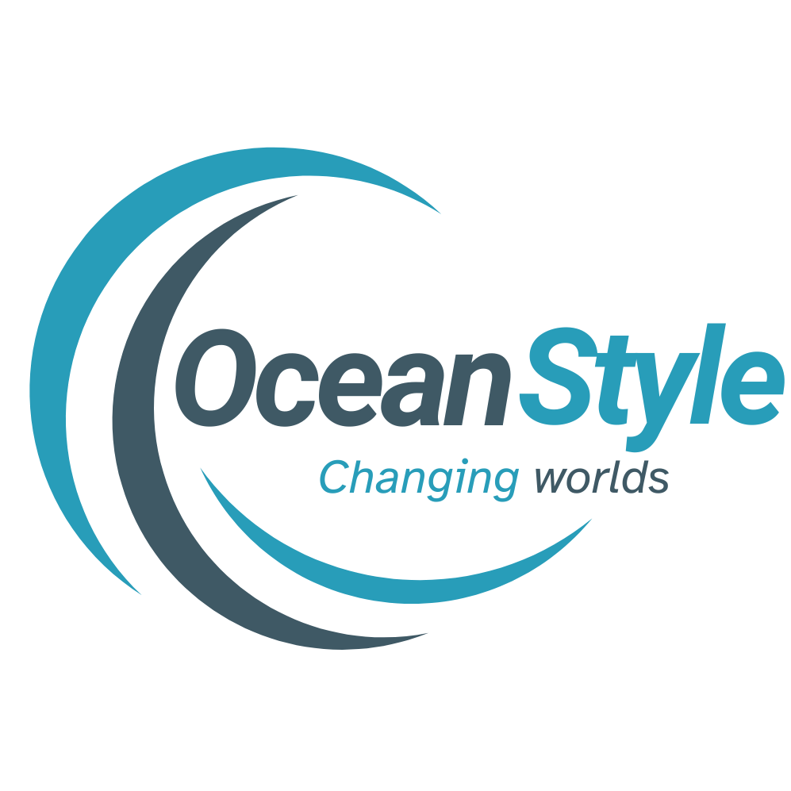

<h1 align="center" id="global-solution">
🌊 Mobile OceanStyle
</h1>

<picture>
  
</picture>

> Repositório utilizado para a entrega da 1ª Global Solution de Desenvolvimento Mobile.

  
<h3><strong>Índice</strong></h3>

  <ol>
    <li><a href="#integrantes">Integrantes</a></li>
    <li><a href="#requisitos">Requisitos</a></li>
  </ol>

<h1 id="integrantes">✍️ Integrantes</h1>

### Turma: 2TDSS

- Augusto Barcelos Barros – RM: 98078
- Lucas Pinheiro de Melo – RM: 97707

### Turma: 2TDSA

- Izabelly De Oliveira Menezes - RM: 551423
- Marcos Henrique Garrido da Silva - RM: 99578
- Mel Maia Rodrigues – RM: 98266

<h1 id="requisitos">📋 Requisitos</h1>

- [x] Utilizar navegação no aplicativo conforme sua escolha (10 pts)

- [x] Implementar um CRUD com Firebase e/ou uma API REST (para API REST: forneça um endpoint funcional fakeapi ou mock) (10 pts)

- [x] Tratar os erros das requisições de forma adequada (20 pts)

- [x] Estilização do aplicativo, incluindo cores, fontes e imagens personalizadas (30 pts)

- [x] Arquitetura: será avaliada a organização dos arquivos, nomes das variáveis, funções e componentes utilizados (30 pts)
